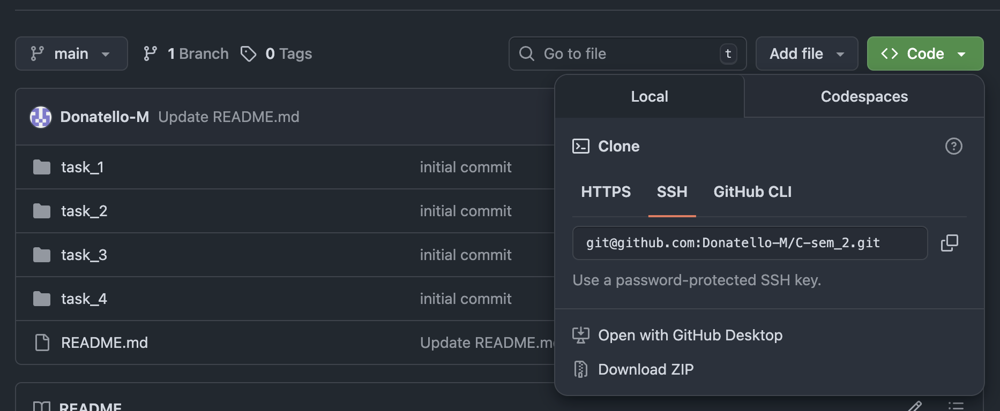

# Выполнение контрольной работы №1

Контрольная работа состоит из 3 заданий. Каждое задание в данном случае соответсвует пройденным темам на семинарах.
Задания оцениваются следующим образом:
```
Задание 1 -> 3 балла
Задание 2 -> 3 балла
Задание 3 -> 4 балла
```
Срок сдачи контрольной работы: **15:00 - 15.03.2026**

Список вариантов заданий находится в файле [tasks.md](/test_1/tasks.md).

Распределение вариантов по студентам - в файле [allocation.md](/test_1/allocation.md)

## Порядок выполнения контрольной работы

1. Необходимо скопировать репозиторий на свой компьютер:

    1) Для этого в корне репозитория на GitHub вы можете найти кнопку `Code`, где увидете ссылку на репозиторий(копировать через https или через ssh можете решить сами)

    

    2) Открыть терминал/командную строку и перейти в желаемую директорию

    3) Выполнить команду клонирующую репозиторий:
       ``` git clone <repository_url> ```
    
    4) После клонирования перейти в директорию с проектом:
       ``` cd /test_1 ```
    
    5) На данный момент вы находитесь на ветке `main`. Вам необходимо создать собственную ветку и переключиться на нее. Формат наименования ветки `<Имя>.<Фамилия>`(Например, danila.makarichev):
    ``` git checkout -b danila.makarichev ```

    6) После этого можно приступать к выполнению работы. Для этого создайте директории под каждое задание внутри папки `/test_1`. Внутри директорий можете поместить описание задания в markdown-файле и решение в файле с расширением `.с`

2. После выполнения работы вам необходимо опубликовать свое решение:

    1) Необходимо добавить созданные файлы в стейдж:
    ``` git add . ```
    
        Эта команда добавляет все инициализированные файлы. В случае, если вы делали билд своего решения, то исполняемые файлы не должны попасть в коммит, для этого нужно явно указать путь к файлам:
        ``` git add /test_1/task_1/task_1.c /test_1/task_2/task_2.c (и так далее)```

    2) После добавления файлов в стейдж необходимо сделать коммит. Иными словами зафиксировать примененные в репозитории изменения:
    ```git commit -m'Описание изменений' ```

    3) Выполнить команду публикации изменений:
    ``` git push ```
    Может возникнуть ситуация, при которой у вас не получится запушить изменения сразу, так как ветка не является опубликованной, в терминале будет выведена команда-подсказка, после этого пуш выполнится в штатном режиме

    Важно: Решение контрольной работы должно быть опубликовано одним коммитом, можете оформить `pull request` в интерфейсе GitHub, если желаете увидеть статус по проверке ваших работ, баллы будут выставлены после проверки работ всех студентов.
